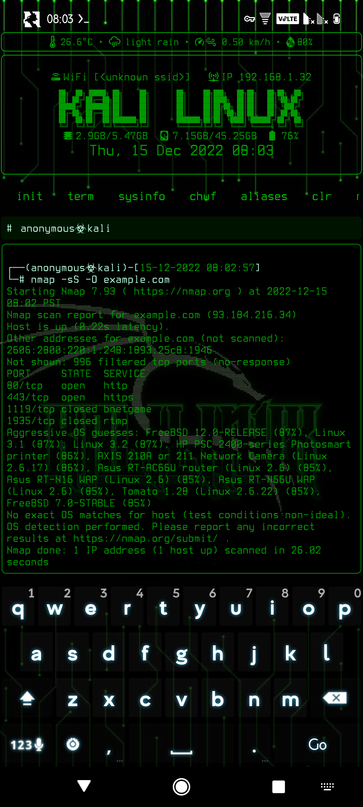
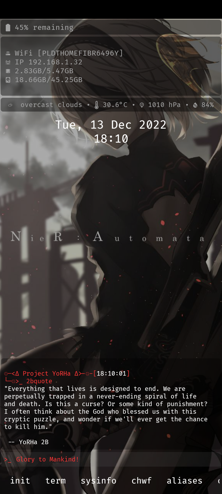
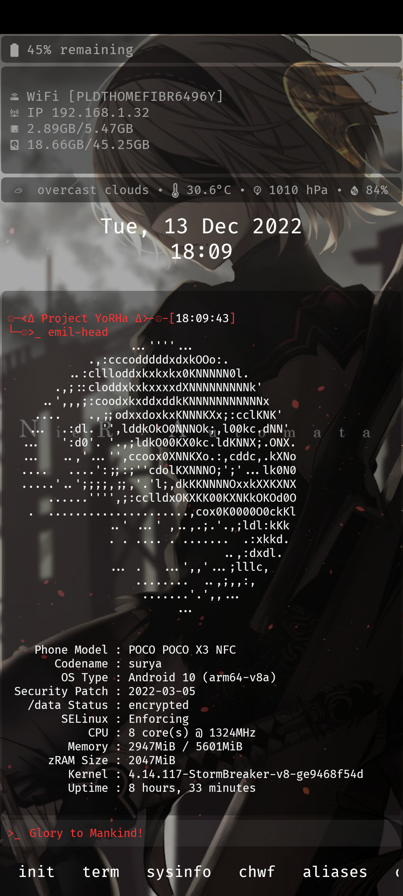
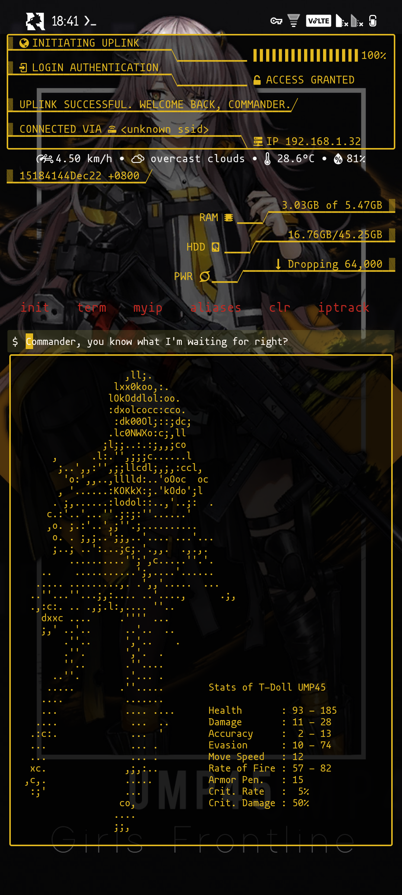
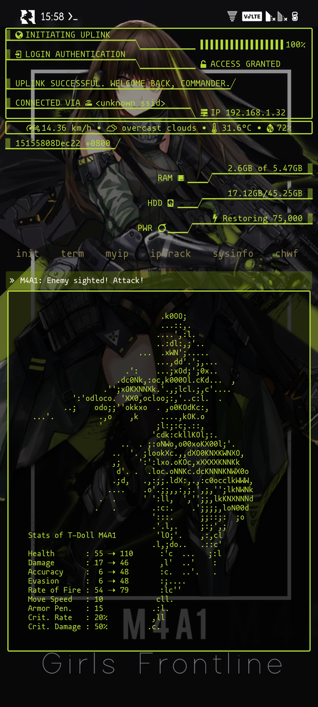
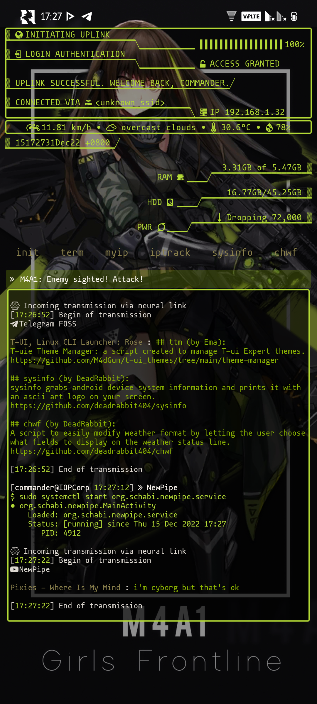

# tui-themes
Collection of my custom-made themes for T-UI Expert Launcher

## Pre-requisites
Download and install [T-UI Expert Launcher](https://github.com/v1nc/T-UI-Expert/releases/download/v0.4.4e/de.reckendrees.systems.tui.expert_fdroid_v.0.4.4e.apk)  

## How to install themes
- Download your desired theme below
- Extract the file and copy the folder **t-ui** to **/storage/emulated/** directory
- type `restart` on t-ui launcher and enjoy your theme  

**Note:** You need to manually set the wallpaper included in the theme for it to take effect

## Nethunter

[Download Nethunter Theme](https://github.com/deadrabbit404/tui-themes/blob/main/themes/nethunter/nethunter.zip?raw=true)

## Nier Automata

[Download Nier Automata Theme](https://github.com/deadrabbit404/tui-themes/blob/main/themes/nier_automata/nier_automata.zip?raw=true)

## Girls Frontline: UMP45

[Download Girls Frontline UMP45 Theme](https://github.com/deadrabbit404/tui-themes/blob/main/themes/gf_ump45/gf_ump45.zip?raw=true)

## Girls Frontline: M4A1

[Download Girls Frontline M4A1 Theme](https://github.com/deadrabbit404/tui-themes/blob/main/themes/gf_m4a1/gf_m4a1.zip?raw=true)